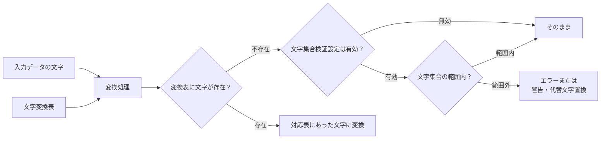

# CSV文字変換CLIツール

CSVファイルの指定した列に対して、文字変換表を使用して文字単位での変換を行うコマンドラインツールです。

## 概要

このツールは、CSV形式のデータファイル内の特定の列に対して、あらかじめ定義された変換表に基づいて文字を一対一で変換します。特定の文字セット間での変換作業に使用されることを想定しています。
Unicode IVS（Ideographic Variation Sequence）に対応し、複雑な文字構成も正確に処理できます。

## 変換処理フロー



### 処理例

**例1: 文字集合検証無効**
入力ファイルより出力ファイルの方が、扱える文字セットが大きい用途を想定。
- 入力文字「龍」→ 変換表で「龙」に変換 → 「龙」出力
- 入力文字「𠮷」→ 変換表になし → 設定に応じて処理（`error`:エラーとして終了/`warn`:警告を出して続行/`skip`:何もしない）


**例2: 文字集合検証有効（JIS90範囲チェック）**
入力ファイルより出力ファイルの方が、扱える文字セットが小さい用途を想定。変換先が無い場合を考慮し、何らかの代替文字に置き換えることが可能。

- 入力文字「龍」→ 変換表で「龙」に変換 → JIS90範囲内 → 「龙」出力
- 入力文字「𠮷」→ 変換表になし → JIS90範囲外 → 警告 + 「■」に置換(`warn`とし、代替文字を設定)


## 主な機能

- **Unicode IVS対応**: Ideographic Variation Sequenceを含む複雑な文字も正確に処理
- **柔軟なエンコーディング対応**: UTF-8をはじめとする様々な文字エンコーディングに対応
- **文字エンコーディング検証**: iconv-liteによる特定エンコーディングへの変換可能性チェック
- **列指定変換**: CSVファイルの任意の列のみを変換対象に指定可能
- **ヘッダー行処理**: ヘッダー行の有無を設定可能（入力・出力で個別設定）
- **エラーハンドリング**: 変換表にない文字の処理方法を選択可能（error/skip/warn）
- **置換文字機能**: 変換できない文字を指定文字で置換可能
- **詳細ログ**: Winston使用の高機能ログシステム
- **設定駆動**: JSON設定ファイルによる柔軟な処理設定
- **包括的テスト**: 107個のテストケースによる品質保証

## インストール

```bash
# 依存関係のインストール
npm install

# プロジェクトのビルド
npm run build

# コード品質チェック
npm run lint

# テスト実行（開発時）
npm run test:run
```

## 使用方法

### 基本的な使用方法

**Linux/macOS:**
```bash
# デフォルトの設定ファイル (config.json) を使用
npm start

# 設定ファイルを指定
npm start -- --config my-config.json

# デバッグモードで実行
npm start -- --config config.json --verbose
```

**Windows:**
```batch
# デフォルトの設定ファイル (config.json) を使用
run.bat

# 設定ファイルを指定
run.bat my-config.json

# 入力・出力ファイルをパラメータで指定（設定ファイルの値を上書き）
run.bat --input data.csv --output result.csv

# 設定ファイルと入力・出力ファイルの両方を指定
run.bat my-config.json --input data.csv --output result.csv

# バッチモード（他プログラムからの呼び出し用・エラー時pause無し）
run.bat my-config.json --batch

# 全パラメータを組み合わせ
run.bat my-config.json --input data.csv --output result.csv --batch
```

### 開発モード

```bash
# TypeScriptファイルを直接実行（開発時）
npm run dev
```

### 終了コード
- **0**: 正常完了
- **1**: エラー発生
- **2**: 警告付き完了（処理は完了したが警告あり）

## 設定ファイル

設定はJSON形式のファイルで指定します。以下は設定例です：

```json
{
  "conversion": {
    "input": {
      "path": "sample/input.csv",
      "encoding": "utf8",
      "lineBreak": "lf",
      "quote": "\"",
      "hasHeader": true
    },
    "output": {
      "path": "sample/output.csv", 
      "encoding": "utf8",
      "lineBreak": "lf",
      "quote": "\"",
      "hasHeader": true
    },
    "conversionTable": "sample/conversion.csv",
    "targetColumns": [1, 2],
    "missingCharacterHandling": "warn",
    "characterSetValidation": {
      "enabled": true,
      "targetEncoding": "shift_jis",
      "undefinedCharacterHandling": "warn",
      "altChar": "?"
    }
  },
  "logging": {
    "level": "info",
    "output": "console"
  }
}
```

### 設定項目詳細

#### conversion
- **input**: 入力ファイルの設定
  - `path`: 入力CSVファイルのパス
  - `encoding`: ファイルエンコーディング（utf8, shift_jis, etc.）
  - `lineBreak`: 改行コード（lf, crlf, cr）
  - `quote`: クォート文字
  - `hasHeader`: ヘッダー行の有無
- **output**: 出力ファイルの設定（inputと同様の項目）
- **conversionTable**: 文字変換表CSVファイルのパス
- **targetColumns**: 変換対象の列番号配列（0から開始）
- **characterSetValidation**: 変換表にない文字の文字集合検証設定（オプション）
  - `enabled`: 検証機能の有効化
  - `targetEncoding`: 対象エンコーディング（JIS90との検証の場合：'shift_jis', JIS2004との検証の場合：'shift_jis-2004'）
  - `undefinedCharacterHandling`: 含まれない文字の処理方法
    - `error`: エラーで停止
    - `warn`: 警告を出力して継続
  - `altChar`: 警告時の置換文字（省略時はそのまま出力）
- **missingCharacterHandling**: 変換表にない文字の処理方法（文字集合検証設定が無効時のみ動作）
  - `error`: エラーで停止
  - `skip`: 変換をスキップ
  - `warn`: 警告を出力して継続

#### logging
- **level**: ログレベル（error, warn, info, debug）
- **output**: ログ出力先（console, file）
- **logFile**: ファイル出力時のログファイルパス（省略可）

## 文字変換表の形式

文字変換表はCSV形式で、以下のフォーマットで作成します：

```csv
変換前文字,変換後文字
龍,龙
鳳,凤
車,车
```

- ヘッダー行は不要
- 1行目：変換前の文字
- 2行目：変換後の文字

### 文字対応表変換ユーティリティ

`src/utils/mojimap-converter.ts`は、複数の文字情報を含むCSVファイルから、本ツールで使用する形式の変換表を生成するユーティリティです。
**特定の団体専用のツールです。**

#### 機能概要
- **元データ処理**: HKコード、MJコード、IVSコード、Unicodeコードなどの複数文字情報を含むCSVを処理
- **双方向変換表生成**: MJ→HK変換表とHK→MJ変換表の両方を自動生成
- **文字優先順位**: IVS文字 > Real文字 > Unicode文字の優先順位で変換後文字を決定
- **重複除去**: 同一文字ペアの重複を自動除去

#### 入力データ形式
```csv
HKCode,HKChar,MJCode,KanjiLevel,RealCode,RealChar,IVSCode,IVSChar,UnicodeCode,UnicodeChar
1-16-01,亜,1-16-01,1,U+4E9C,亞,,，U+4E9C,亞
```

#### 使用例
```typescript
import { convertMappingTable } from './src/utils/mojimap-converter';

convertMappingTable(
  'source-mapping.csv',      // 入力：複合文字情報CSV
  'mj-to-hk.csv',           // 出力：MJ→HK変換表
  'hk-to-mj.csv'            // 出力：HK→MJ変換表
);
```

生成される変換表は本ツールの`conversionTable`設定で直接利用できます。

## プロジェクト構成

### ディレクトリ構造
```
/
├── src/                    # ソースコード
│   ├── cli.ts             # CLI引数処理・設定検証
│   ├── index.ts           # エントリーポイント
│   ├── processor.ts       # メイン変換処理
│   ├── types/
│   │   └── config.ts      # 型定義
│   └── utils/             # ユーティリティ関数
│       ├── character-set.ts # 文字エンコーディング検証
│       ├── converter.ts   # 文字変換ロジック
│       ├── csv.ts         # CSV入出力
│       ├── logger.ts      # ログ機能
│       ├── mojimap-converter.ts # 文字対応表変換ユーティリティ
│       └── unicode.ts     # Unicode文字処理
├── tests/                 # テストコード
│   ├── unit/             # ユニットテスト
│   ├── integration/      # 統合テスト
│   └── fixtures/         # テストデータ
├── sample/               # サンプルファイル
├── config*.json          # 設定ファイル例
├── dist/                 # ビルド成果物
├── coverage/             # テストカバレッジ
└── logs/                 # ログファイル
```

### サンプルファイル

`sample/`ディレクトリに以下のファイルが含まれています：

- `input.csv`: サンプル入力ファイル
- `conversion.csv`: サンプル変換表
- `output.csv`: 期待される出力結果
- 設定例: `config.json`

## ログ出力例

```
=================================================================
CSV文字変換処理を開始します
処理開始時刻: 2025-08-28T10:00:00.000Z
=================================================================
入力ファイルパス: /path/to/input.csv
出力ファイルパス: /path/to/output.csv
変換表ファイルパス: /path/to/conversion.csv
対象列番号: [1, 2] (0から開始)
入力ファイルエンコーディング: utf8
出力ファイルエンコーディング: utf8
入力ファイルヘッダー: あり
出力ファイルヘッダー: あり
文字変換表にない文字の処理方式: warn
-----------------------------------------------------------------
変換ルール数: 100件
処理対象データ行数: 500行 (2行目～501行目)
-----------------------------------------------------------------
処理中... 1000行完了
-----------------------------------------------------------------
データ行処理完了: 全500行を処理
出力ファイル書き込み完了: 501行出力
=================================================================
【処理結果レポート】
処理完了時刻: 2025-08-28T10:01:00.000Z
処理ステータス: 正常完了
入力ファイル: /path/to/input.csv (501行)
出力ファイル: /path/to/output.csv (501行)
処理データ行数: 500行
文字変換ルール適用数: 100件
対象列: [1, 2]
✅ CSV文字変換処理が正常に完了しました
=================================================================
```

## 技術スタック

- **言語**: TypeScript（ES2022、ESNext）
- **ランタイム**: Node.js 22+
- **ビルドツール**: esbuild
- **テストフレームワーク**: Vitest + @vitest/ui + カバレッジ
- **パッケージマネージャー**: npm/pnpm

### 主要依存関係
- `csv-parse`: CSV解析
- `csv-stringify`: CSV生成
- `iconv-lite`: 文字エンコーディング変換
- `winston`: ログ処理
- `yargs`: コマンドライン引数解析

### 開発依存関係
- `vitest`: テストフレームワーク
- `@vitest/coverage-v8`: カバレッジ測定
- `tsx`: TypeScript実行ツール
- `@biomejs/biome`: コードフォーマッター・リンター

## テスト

このプロジェクトにはVitestベースの包括的なテストスイートが含まれています：

```bash
# すべてのテスト実行
npm test

# 一度だけテスト実行
npm run test:run


# カバレッジ付きテスト実行
npm run test:coverage
```

### テスト構成

**ユニットテスト** (`tests/unit/`)
- `unicode.test.ts`: Unicode文字分割・結合（IVS対応）
- `converter.test.ts`: 文字変換ロジック（変換表、エラーハンドリング）
- `character-set.test.ts`: 文字エンコーディング検証
- `csv.test.ts`: CSV読み書き（エンコーディング、改行コード）
- `cli.test.ts`: 設定ファイル検証
- `processor.test.ts`: メイン処理フロー

**統合テスト** (`tests/integration/`)
- `end-to-end.test.ts`: 完全な変換プロセスの統合テスト
- `character-set-integration.test.ts`: 文字エンコーディング検証統合テスト

**テストフィクスチャ** (`tests/fixtures/`)
- サンプルCSVファイル、変換表、設定ファイル

### テスト結果
- **107個のテストケース** - 全て成功
- **包括的カバレッジ** - 主要ロジックを網羅
- **継続的テスト** - Vitestのウォッチモード対応

## ライセンス

MIT License - 詳細は[LICENSE](LICENSE)ファイルを参照してください。

Copyright (c) 2025 ogrtk

## 開発

このプロジェクトの開発に関する詳細は、`CLAUDE.md`を参照してください。